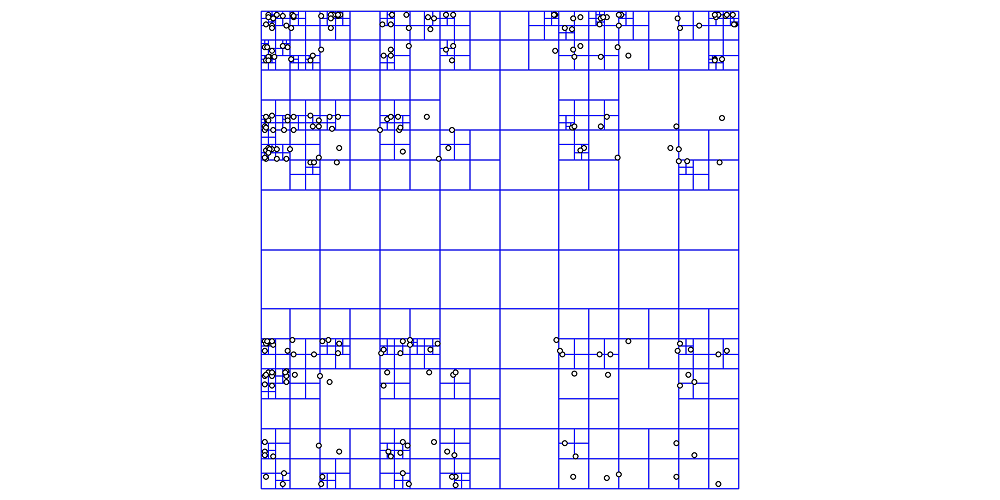

## Intro

I'm currently working on a hobby game that needs to simulate an entire planet. Games like [No Man's Sky](https://www.nomanssky.com/) and [Kerbal Space Program](https://store.steampowered.com/app/220200/Kerbal_Space_Program/) generate an entire planet, so I looked up to these games when developing my procedural terrain system. At minimum, I would want the planet to be pretty big (maybe even Earth sized), be fully destructible, and be able to run on most hardware. These minimum requirements alone drove me into weeks long journey on terrain generation. Many of the ideas here were derived from Eric Lengyel's [transvoxel paper](https://transvoxel.org/).

## Faking terrain

In real life, terrain is shaped by natural processes such as tectonic activity and erosion. To simulate these within the constraints of a real-time game is beyond my expertise. However, we can get close enough using some noise function. A noise function returns a scalar value for any $n$-dimensional position:

$$
f: \mathbb{R}^n \to \mathbb{R}
$$

The idea is relatively simple: we start with a $XZ$ planar mesh with a high enough vertex count to represent the desired level of detail. For each vertex, we sample a noise function $f$ and displace that vertex in the $y$-direction by the sampled amount. Godot lets us sample a noise function in C# with `GetNoise2D`. We define a `FastNoiseLite noise` variable and sample it at position `Vector3 v`.

```cs
float displacement = noise.GetNoise2D(v.x, v.z);
```

We then use `displacement` to modify the vertex's y-coordinate. Repeating this for every vertex produces fairly believable-looking terrain. This article from [Red Blob Games](https://www.redblobgames.com/maps/terrain-from-noise/) is a good source if you want to learn more about making terrain this way.

<wireframe-model-viewer src="/models/plane-noise-simple.glb" aria-label="Interactive wireframe model of a plane displaced with noise" zoom="1.5" rotation="-10 0 0" camera-position="0 0 0" projection="orthographic" zoom-enabled="false">
  <a href="/models/plane-noise-simple.glb">Download the 3D model</a>
</wireframe-model-viewer>

If we wanted a bigger map, we could have the surface stretch out farther and also increase the number of vertices so that the resolution remains high. But we can only do this so much before we hit the first set of bottlenecks: **memory** and **generation time**. At some point, the surface will contain so many vertices that it consumes a significant amount of memory and, depending on the hardware, takes far too long to generate. Scaling our terrain this way makes it impractical for games, so we need another solution.

## Level of detail

The farther away something is, the less detail we can make out. This observation leads to an important optimization: we only need high-resolution terrain near the camera, while terrain farther away can be represented using fewer vertices. The most natural thing to do then is to have our terrain system generate more vertices the closer we are, and less vertices the farther we are. However, our current setup does not really generate anything; it only moves vertices around. If we were to implement LOD into our system, a more robust solution is desired.

Let's imagine we had a system that could automatically generate planar meshes for any region we define, with a resolution of our choosing. Then the problem becomes much simpler: we just need a way to divide the terrain into chunks and decrease the resolution of those chunks as their distance from the viewer increases. A [quadtree](https://en.wikipedia.org/wiki/Quadtree) naturally handles this type of setup, especially for terrain generated using a heightmap. A similar data structure is the [octree](https://en.wikipedia.org/wiki/Octree), which can be thought of as an extension of the quadtree into 3D space. Each of these are tree data structures with 4 and 8 children respectively.



Going back to our requirements, we want to represent the world as a spherical planet. This already complicates a purely planar approach, although techniques such as mapping a cube onto a sphere to form a quadsphere could still be used. More importantly, heightmap-based terrain cannot represent features such as caves or overhangs because each $XZ$ coordinate gets assigned only 1 $y$-value. These constraints suggest that we need a volumetric representation of the terrain rather than a surface-based one. For this reason, I went with voxels to represent the world and an octree to spatially organize them.

## Implicit surfaces

An implicit surface is defined as a surface in Euclidean space defined by an equation

$$
F(x, y, z) = 0.
$$

In other words, an implicit surface is the set of zeroes of a function of three variables. To represent our planet, we'll use the implicit surface of a sphere defined by the [signed distance function](https://en.wikipedia.org/wiki/Signed_distance_function)

$$
f(p) = ||p|| - r
$$

where $r$ is the radius of the sphere and $p=(x,y,z)$ is a sample point in 3D space. You can think of it as a scalar field where points at the surface have a value of $0$, points inside the sphere have negative values, and points outside the sphere have positive values.

In order for this to be useful, we need a way to extract a polygonal mesh from the implicit surface. The most popular method is to use [marching cubes](https://en.wikipedia.org/wiki/Marching_cubes).

Marching Cubes works by dividing the world into cubic cells and sampling each corner of every cube. This gives each corner a binary classification, so each cell has $2^8 = 256$ possible configurations. The eight classifications can be combined into an 8-bit key, which is used to look up the corresponding mesh configuration for that cell.

The code snippet below samples each corner of a cell and constructs the lookup key, `caseCode`. Each corner corresponds to one bit in the key. If the sampled value is below the isovalue, that bit is set to `1`; otherwise, it remains `0`.

```csharp
for (var i = 0; i < corners.Length; i++)
{
	var corner = minCorner + CornerOffsets[i] * step;
	corners[i] = Sample.GetSignedDistance(corner);

	caseCode |= (corners[i] < IsoValue ? 1 : 0) << i;
}
```

`caseCode` is then used as a key in the lookup table to determine how to polgyonize that cell. The lookup tables for marching cubes can be found on Paul Bourke's [marching cubes article](https://paulbourke.net/geometry/polygonise/) or on Eric Lengyel's [transvoxels page](https://transvoxel.org). When marching cubes is applied to our sphere SDF, we get a result similar to the one below.

<wireframe-model-viewer src="/models/mc-no-lerp.glb" aria-label="Interactive wireframe model of a plane displaced with noise" zoom="1.5" rotation="0 0 0" camera-position="-1 0.5 2" projection="orthographic" zoom-enabled="false" wireframe="true">
  <a href="/models/mc-no-lerpglb">Download the 3D model</a>
</wireframe-model-viewer>

Notice that the model is not perfectly smooth. Although the underlying scalar field represents a sphere, the generated mesh has noticeable "steps" caused by the finite sampling resolution. We can further improve the accuracy of marching cubes in two ways: increasing the **resolution** for our marching cubes implementation, or by using **[linear interpolation](https://en.wikipedia.org/wiki/Linear_interpolation)**. While increasing the resolution can produce a more detailed mesh, it also significantly increases the computational cost. Doubling the resolution of marching cubes along each axis increases the cost by approximately a factor of eight.

Interpolation provides a much cheaper way to improve the placement of generated vertices without increasing the number of sampled cells. The goal is have the generated vertex closer to where the implicit surface intersects the active edge. The intersection point $\mathbf{p}$ can be found using

$$
\mathbf{p}=\mathbf{A} + \frac{I - a}{b - a}(\mathbf{B} - \mathbf{A})
$$

where $\mathbf{A}$ and $\mathbf{B}$ are the endpoints of the active edge, $a$ and $b$ are the sample values at the respective vertex, and $I$ is the iso-value (which in our case is 0).

Using interpolation places each generated vertex closer to the actual zero-crossing of the SDF, giving us a more accurate representation of the implicit surface. The sphere below was generated using marching cubes with linear interpolation.

<wireframe-model-viewer src="/models/mc-sphere.glb" aria-label="Interactive wireframe model of a plane displaced with noise" zoom="1.5" rotation="0 0 0" camera-position="-1 0.5 2" projection="orthographic" zoom-enabled="false" wireframe="true">
  <a href="/models/mc-sphere.glb">Download the 3D model</a>
</wireframe-model-viewer>
