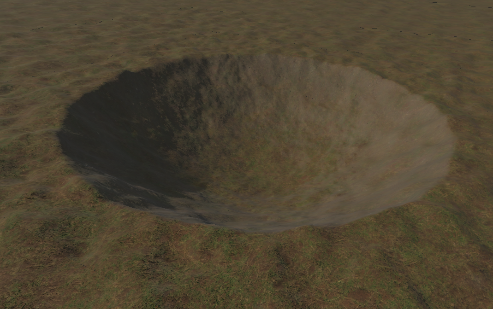

## Texture Mapping

In order to apply texture maps to a mesh, we must be able to specify a mapping function that provides texture sampling coordinates for each vertex position. This is ordinarily accomplished by performing some kind of projection on the vertex positions themselves to obtain two-dimensional texture coordinates. In certain scenarios, however, mapping textures in this way can cause stretching artifacts when the slope of the surface approaches infinity. This issue is especially prevalent when dealing with voxel terrain. **Triplanar projection** is a technique that addresses this problem by projecting the texture along multiple axes and blending the results based on the orientation of the surface.

## Triplanar Projection

Triplanar project generates three sets of texture coordinates by projecting the vertex positions onto planes perpendicular to each of the three coordinate axes. Up to three different texture maps are then sampled, and the results are blended based on the direction in which the vertex normal points.

If the surface normal forms an obtuse angle with the plane's normal, then the texture image is flipped in one direction. This is mitigated by negating one of the texture coordinates generated for each plane whenever the surface normal forms a negative dot product with the plane normal, which is just picking off individual components of the surface normal because the plane normals are aligned to the coordinate axes.

We calculate our three sets of texture coordinates $(s_x,t_x), (s_y,t_y), (s_z,t_z)$ as follows, where $\mathbf{p}$ is the scaled vertex position.

$$
\begin{aligned}
s_x &=
\begin{cases}
p_y, & \text{if } N_x \ge 0, \\
-p_y, & \text{if } N_x < 0;
\end{cases}
\\
s_y &=
\begin{cases}
-p_x, & \text{if } N_y \ge 0, \\
p_x, & \text{if } N_y < 0;
\end{cases}
\\
s_z &=
\begin{cases}
p_x, & \text{if } N_z \ge 0, \\
-p_x, & \text{if } N_z < 0;
\end{cases}
\\
t_x &= t_y = p_z \\
t_z &= p_y.
\end{aligned}
$$

Using the coordinates provided by this equation ensures that a texture image is never mirrored when a cube face is viewed from its front side. Once the three sets of texture coordinates have been determined, we can sample one texture map at three different locations, or we can choose to sample up to three different texture maps. In GDShader, we do this using the `texture()` function. We'll have to combine the color samples in such a way that stretching caused by any one of the projections is not visible. Using the normalized weighted averages based on absolute surface norman components gives a sufficient blend.

For my implementation in Godot, I'll calculate the blend weights $b_x$, $b_y$, and $b_z$ using the formulas

$$
\begin{aligned}
b_x &= (\max{\frac{|N_x|}{||\mathbf{N}||}-\delta, 0})^m \\
b_y &= (\max{\frac{|N_y|}{||\mathbf{N}||}-\delta, 0})^m \\
b_z &= (\max{\frac{|N_z|}{||\mathbf{N}||}-\delta, 0})^m, \\
\end{aligned}
$$

where $\mathbf{N}$ is the interpolated vertex normal, $\delta$ is a real number in the interval $[0, \sqrt{3}/3)$, and $m$ is a positive integer. We'll want to ensure the weights are normalized/sum to unity, so we do

$$
\begin{aligned}
b'_x &= \frac{b_x}{b_x + b_y + b_z} \\
b'_y &= \frac{b_y}{b_x + b_y + b_z} \\
b'_z &= \frac{b_z}{b_x + b_y + b_z}. \\
\end{aligned}
$$

The final blended texture sample $C$ is given by

$$
C = b'_xC_x(s_x,t_x)+b'_yC_y(s_y,t_y)+b'_zC_z(s_z,t_z),
$$

where $C_x$, $C_y,$ and $C_z$ are functions representing the value returned by sampling the texture maps associated with the plane normal directions $x$, $y$, and $z$.

## Godot Shader Implementation

We can implement the above into a Godot spatial shader to render textures for say terrain.

```glsl
shader_type spatial;

uniform float m = 1.0; // Can be thought of as cutoff
uniform float delta = 0.25; // Can be thought of as texture blend threshold
uniform float scale = 25.0; // Texture scale (greater = larger texture)

// x-coordinate texture
uniform sampler2D alb_x : source_color;

// y-coordinate texture
uniform sampler2D alb_y : source_color;

// z-coordinate texture
uniform sampler2D alb_z : source_color;

vec3 triplanar(sampler2D txt_x, sampler2D txt_y, sampler2D txt_z, vec3 p, vec3 n) {
	// Flip texture based on normal direction to prevent mirroring
	vec4 f = vec4(n.x < 0.0 ? -1.0 : 1.0, n.y >= 0.0 ? -1.0 : 1.0, n.z < 0.0 ? -1.0 : 1.0, 1.0);

	// Sample the 3 texture maps, and f.a is used to only negate one axis
	vec4 x = texture(txt_x, (p.yz * f.ra) / scale);
	vec4 y = texture(txt_y, (p.zx * f.ga) / scale);
	vec4 z = texture(txt_z, (p.xy * f.ba) / scale);

	// Get blend weights
	float bx = pow(max(abs(n.x) - delta, 0.0), m);
	float by = pow(max(abs(n.y) - delta, 0.0), m);
	float bz = pow(max(abs(n.z) - delta, 0.0), m);

	// Blend the values
	vec4 res = (bx * x + by * y + bz * z) / max(bx + by + bz, 0.001);

	return res.xyz;
}

void fragment() {
	vec3 pos = (INV_VIEW_MATRIX * vec4(VERTEX, 1.0)).xyz;
	vec3 nor = (INV_VIEW_MATRIX * vec4(NORMAL, 0.0)).xyz;

	ALBEDO = triplanar(alb_x, alb_y, alb_z, pos, nor);
}
```

Note that in Godot, the Y axis points up. This will give us something like the result below. The texture projected onto the $XZ$ plane was sourced from https://polyhaven.com/a/dirt, while the texture used for the $Y$-axis projection was sourced from https://polyhaven.com/a/sparse_grass.


